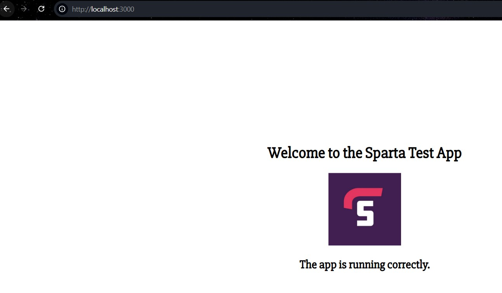
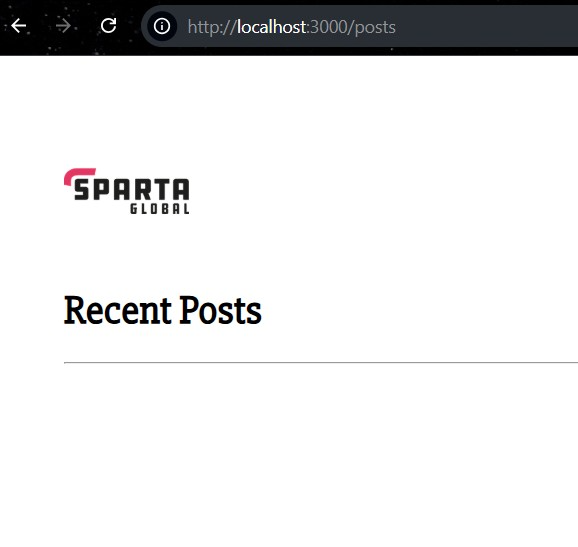
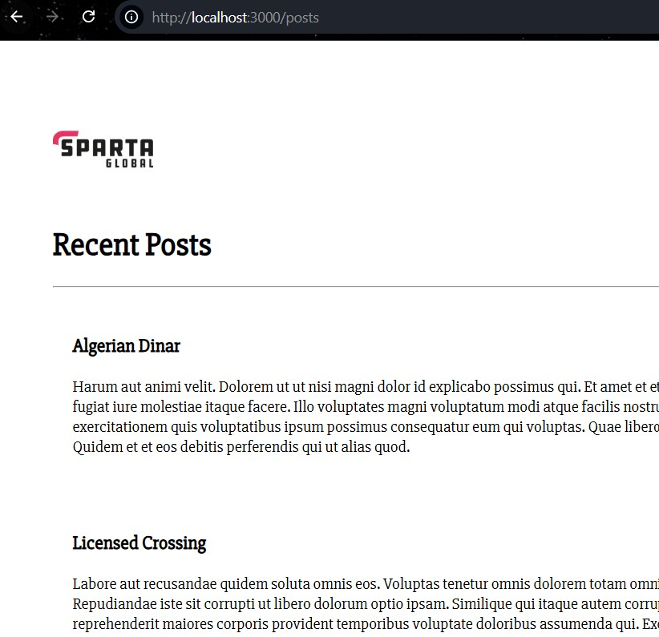
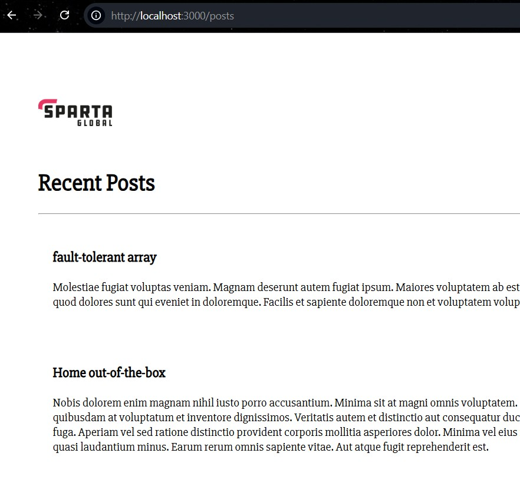
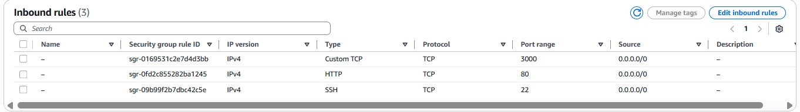
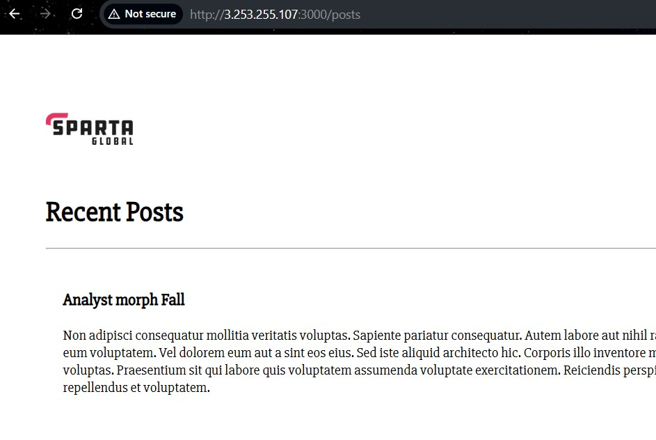
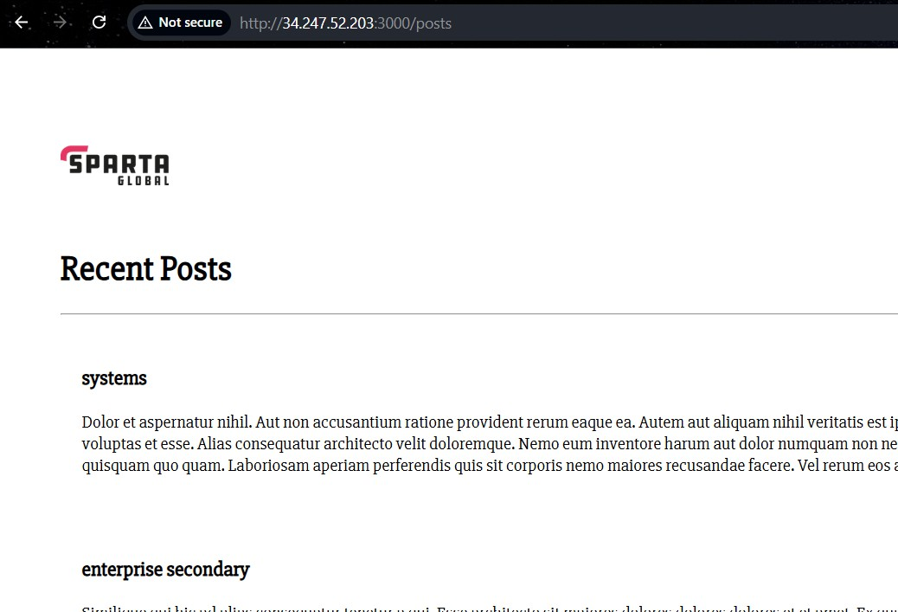

# Day 2 - Use Docker for App Deployment

# Task: Run Sparta test app in a container


Task: Run Sparta test app in a container

Aim: Run Node JS v20 Sparta test app in a Docker container (frontpage only)

Timing: 1 hour

1. Create a new folder for this task (because you can only have one Dockerfile per folder)

folder name 'tech515-docker-app-project8'

2. Put your 'app' folder in the that folder

- Sparta app runs with Node.js v20
- The app listens on port 3000
- Folder name is app

3. Create a new Dockerfile

4. Steps for the Dockerfile:
```
# from which image
FROM node:20

# label
LABEL maintainer="lucy stevenson"

# set the default working directory to /usr/src/app
WORKDIR /usr/src/app

# copy app folder (to same place as Dockerfile, then copy to default location in container)
COPY app /usr/src/app

# COPY package*.json ./
COPY app/package*.json ./

# install dependencies with npm
RUN npm install

# expose port
EXPOSE 3000

# CMD [node app.js or npm start]
CMD ["node", "app.js"] / CMD ["npm", "start"]
```

5. You should be able to run three docker commands to get the app running at port 3000 (as well as get the container image which is build pushed to Docker Hub):

```
docker build

docker run

docker push
```

- build the Docker image `docker build -t lucysteve/tech515-sparta-app:v1 .`
- run the container `docker run -d -p 3000:3000 --name sparta-app lucysteve/tech515-sparta-app:v1`
- push image to docker hub
`docker login`
`docker push lucysteve/tech515-sparta-app:v1`

The app is now deployable anywhere.

6. Force docker to pull a fresh image from Docker Hub to re-run your own app image

- Stop & remove local container
`docker rm -f sparta-app`

- Remove local image
`docker rmi lucysteve/tech515-sparta-app:v1`

- re run 
`docker run -d -p 3000:3000 --name sparta-app lucysteve/tech515-sparta-app:v1`


check: http://localhost:3000/



---

<br>
<br>

# Task: Research Docker Compose

✅ Summary

Docker Compose allows you to:
- Define **multi-container apps in one file**
- Run everything with one command
- Manage services efficiently
- Maintain consistency across environments

# 📦 Docker Compose – Research

## Why use Docker Compose?

Docker Compose is a tool that allows you to **define and run multi-container Docker applications** using a single configuration file.

Instead of running multiple long `docker run` commands, Docker Compose allows you to:
- Define **multiple services** (e.g. web app, database)
- Define **networks and volumes**
- Start and stop everything with **one command**

### Benefits
- Simplifies **multi-container application management**
- Ensures **consistent environments**
- Reduces command complexity
- Ideal for **local development, testing, and CI/CD**

---

## How to use Docker Compose

Docker Compose uses a YAML configuration file (usually `docker-compose.yml`) to define:
- Services (containers)
- Images or build instructions
- Port mappings
- Volumes
- Environment variables
- Networks

---

### What do you need to install for it to work?

#### Windows / macOS
- **Docker Desktop**
- Docker Compose **v2 is included by default**

#### Linux
- Docker Engine
- Docker Compose plugin

Check installation:

bash: `docker compose version`

⚠️ Note:
- docker compose (space) = v2 (current)
- docker-compose (hyphen) = v1 (deprecated)

### How to store your Docker Compose file
- File name: `docker-compose.yml`

- Location:
  - Store in the root of your project
  - Usually alongside your Dockerfile

- Example project structure:

```
project/
├── app/
├── Dockerfile
└── docker-compose.yml
```

### Docker Compose Commands

#### 🛠 Manage your application
```
docker compose up
docker compose down
```
#### ▶ Start the application (without detached mode)
`docker compose up`

- Runs in the foreground
- Displays logs in real time
- Stops when CTRL + C is pressed

#### ▶ Start the application (in detached mode)

`docker compose up -d`

- Runs in the background
- Terminal remains free
- Containers continue running

❓ Difference between detached and non-detached mode
Mode	Description
Non-detached	Logs visible, terminal blocked
**Detached (-d)	Runs in background**

#### ⏹ Stop the application

`docker compose down`
- Stops all containers
- Removes containers and networks
- Does not remove images by default

#### 🔍 Check services running with Docker Compose

`docker compose ps`

#### 📜 View logs in real-time

`docker compose logs -f`

#### Specific service logs:

`docker compose logs -f web`

#### 🖼 View Docker Compose images

`docker compose images`

---

<br>
<br>

# Task: Use Docker Compose to run app and database containers

## Overview
The aim of this task is to use **Docker Compose** to run:
- A **Node.js Sparta test app** container
- A **MongoDB database** container

The application depends on MongoDB, so **both containers must run together**

## 🖼 Required Images

### Do we have the images we need?
- ✅ **Node app**: Uses a custom microservice image pushed to Docker Hub
- ✅ **MongoDB**: Uses an official MongoDB image from Docker Hub

Recommended MongoDB image:
mongo:5.0

## Make Docker compose file

```
version: "3.8"

services:
  mongo:
    image: mongo:5.0
    container_name: mongo
    ports:
      - "27017:27017"
    volumes:
      - mongo-data:/data/db

  app:
    image: lucysteve/sparta-node-app:v1
    container_name: app
    ports:
      - "3000:3000"
    depends_on:
      - mongo
    environment:
      DB_HOST: mongo
    command: npm start

volumes:
  mongo-data:
```

## 🧩 Docker Compose Design

We will create two services:

1. mongo – MongoDB database
2. app – Node.js web application

🔑 No need to manually configure bindIp; Docker networking allows containers to communicate automatically

Docker Compose ensures:

- MongoDB starts before the app
- Both services run on the same Docker network
- Environment variables are passed correctly

## 🗄 Database Service Explanation

- Uses the official MongoDB image
- Exposes port 27017
- Uses a named volume to persist data
- No need to manually configure bindIp; Docker networking allows containers to communicate automatically

## 🌐 Web App Service Explanation

- Uses the custom Node app image from Docker Hub
- Exposes port 3000
- Links to MongoDB using: `DB_HOST=mongo`
- Depends_on ensures MongoDB starts first

## ▶ Running the Application

- Start containers `docker compose up -d` (detached mode with -d)
- Test with
  ```
  http://localhost:3000
  http://localhost:3000/posts
  ```
  - posts is empty as we have not seeded the database yet


🔑 Docker Compose does NOT use your local Dockerfile automatically unless you tell it to build, so I added `build .` in the app services withing docker-compose.yml file:

My Steps

1. Create docker-compose.yml file
```
version: "3.8"

services:
  mongo:
    image: mongo:5.0
    container_name: mongo
    ports:
      - "27017:27017"
    volumes:
      - mongo-data:/data/db

  app:
    build: . # added this as Docker Compose does NOT use your local Dockerfile automatically unless you tell it to build.
    image: lucysteve/sparta-node-app:v1
    container_name: app
    ports:
      - "3000:3000"
    depends_on:
      - mongo
    environment:
      DB_HOST: mongo
    command: npm start

volumes:
  mongo-data:
```

2. Create Dockerfile

```
FROM node:20

LABEL maintainer="lucy stevenson"

WORKDIR /usr/src/app

# copy package files first (better caching)
COPY app/package*.json ./

RUN npm install

# copy rest of app
COPY app .

EXPOSE 3000

CMD ["node", "app.js"]
```

3. Start containers `docker compose up -d --build` (detached mode with -d)
  
``` 
# clean restart
docker compose down
docker compose up -d --build
```
checks:
- `docker compose ps` lists the containers (services) that belong to the current Docker Compose project

- `docker compose logs app` shows the stdout / stderr logs from the app service container (shows errors and start up messages)


1. Test
  ```
  http://localhost:3000
  http://localhost:3000/posts
  ```



## Seeding the database

### Manually

How - logging into the container and running the command

- If you need run a command inside your docker container, use this command:
  - docker exec -it <container-name> <cmd>
  - Examples:
  - `docker exec -it app node seeds/seed.js`
  - `docker exec -it mongo cat /etc/mongod.conf` 
    - Just prints MongoDB’s config file
    - It’s useful if you want to:
      - Check bind IP
      - Check storage paths
      - Learn Mongo internals

**My Steps**

I ran `docker exec -it app node seeds/seed.js`

**What this does?**

- Runs the seed script inside the app container
- Connects to MongoDB using: mongodb://mongo:27017/posts
- Inserts data into the database



### Automatically

1. To automatically seed, I have added a new service in docker-compose.yml and I implemented by executing the seed script when the application container starts:

```
seed:
  image: lucysteve/sparta-node-app:v1
  depends_on:
    - mongo
  environment:
    DB_HOST: mongodb://mongo:27017/posts
  command: node seeds/seed.js
```
I made sure this depends on mongo, so the database is run first

2. Then re-start containers:
```
docker compose down
docker compose up -d --build
```

outcome:


## Extension - Run the containers on an EC2 instance

**My Steps**

1. Create EC2 Instance
- AMI: Ubuntu Server 22.04 LTS
- Instance type: t3.micro (free tier)
- Security Group:
  - SSH → Port 22 → My IP
  - HTTP (Custom TCP) → Port 3000 → 0.0.0.0/0

- User Data:
```
#!/bin/bash

echo "=== Updating system ==="
sudo apt update -y

echo "=== Installing Docker ==="
sudo apt install -y docker.io docker-compose git

echo "enable and start docker"
sudo systemctl start docker
sudo systemctl enable docker

echo "Allow ubuntu to run docker"
sudo usermod -aG docker ubuntu

echo "clone app repo and cd into folder"
git clone https://github.com/lucystevenson/tech515-docker-app-project8.git repo
cd repo


echo "stop containers and remove volumes (to allow reseeding)"
docker-compose down -v

echo " build and run containers"
docker-compose up -d
```
within this github repo we have docker-compose.yml and Dockerfile

- I first made the ec2 and manually ran the Sparta app with the above commands. Output:



- Then I made a new ec2 with the user data above. Output:

